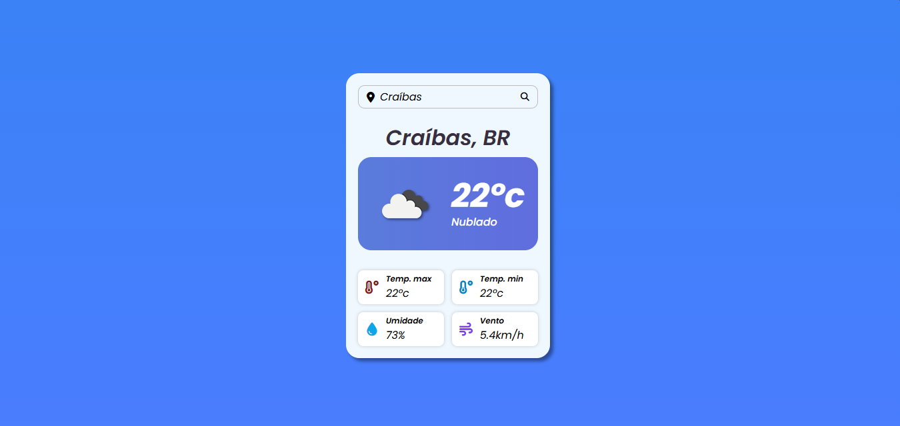

# Projeto Previsão do Tempo

## Descrição do Projeto

O projeto tem o propósito de servir como um aplicativo de previsão de tempo.  
Passando informações como: Temperatura atual, temperatura máxima, temperatura mínima, umidade e vento.

## layout do Projeto em Vídeo

https://github.com/user-attachments/assets/ce98e43b-b0c5-4dac-92da-ce91315691c9

***

## Tecnologias Utilizadas

### Biblioteca de Ícones

- https://cdnjs.com/libraries/font-awesome 
- https://fontawesome.com/

### Créditos

> 
Projeto desenvolvido por Larissa Kich do canal do Youtube Larissa Kich.

#### Modificações 

- Linhas 8, 9, 39 e 40 

##### Para mais projetos acesse o link abaixo

Clique [aqui](https://github.com/Paullo-Nunes) para acessar a minha página do GitHub.
